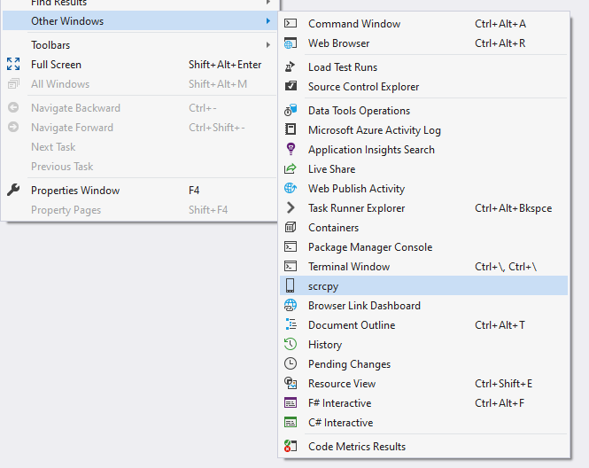
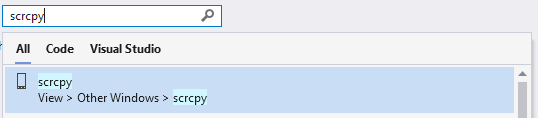
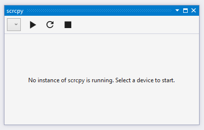
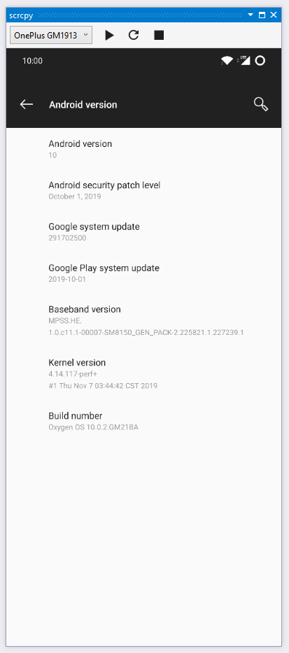

# scrcpy for Visual Studio

A wrapper around [scrcpy](https://github.com/Genymobile/scrcpy) for Visual Studio.

## Usage

After installing the extension ([marketplace](https://marketplace.visualstudio.com/items?itemName=pvdstel.scrcpy)), you will be able to use scrcpy from within Visual Studio. To do so, take the following steps:

1. Find the command to open the scrcpy tool window. This can be found either in the View -> Other windows menu, or using Search (<kbd>Ctrl + Q</kbd>).

    Visual Studio Menu  
    

    Search  
    

2. You will now get an empty scrcpy tool window.

    

    Use the dropdown menu to select your device. Once you have selected a device, press the play button to start controlling your device with scrcpy. Press the stop button to end the session. You can use the refresh button to manually start a search for devices, although the list should be updated automatically when a device is connected or disconnected.

3. Use scrcpy as usual. Keyboard shortcuts and other documentation can be found on the [scrcpy repository](https://github.com/Genymobile/scrcpy).

    
